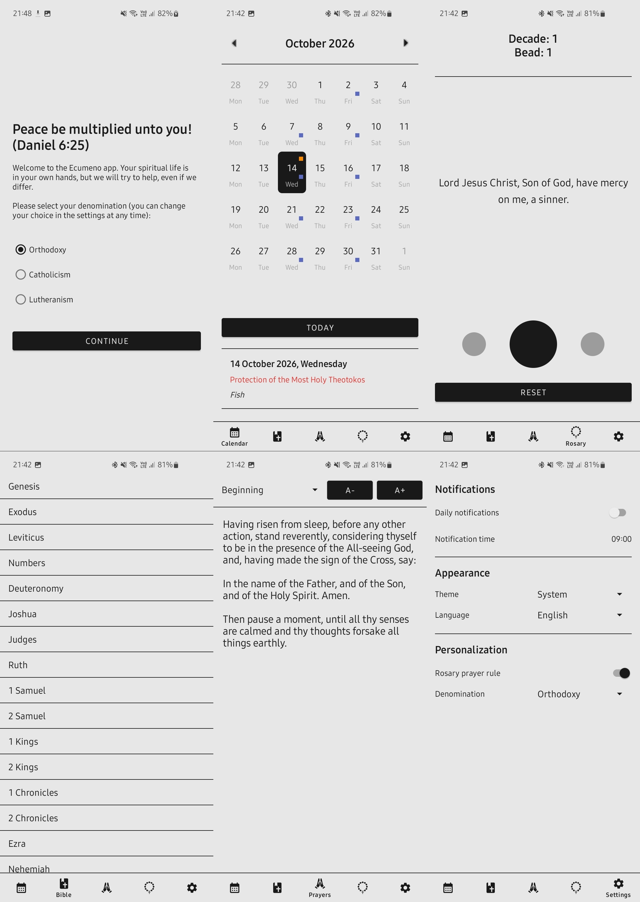
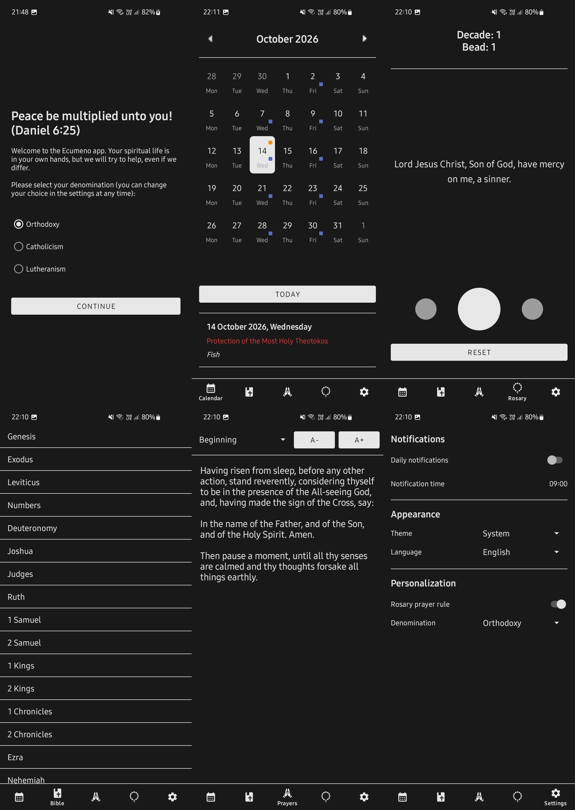

<h1 align="center">Ecumeno</h1>

  

  <a href="README.md">Русский</a> &nbsp;|&nbsp; <b>English</b>

  <i>"Holy Father, keep through Thine own name those whom Thou hast given Me, that they may be one, as We are... That they all may be one; as Thou, Father, art in Me, and I in Thee, that they also may be one in Us" — The Gospel According to John 17:11, 21 (KJV)</i>

  
  
  

<h2>About the project</h2>

  This app was developed as part of a final thesis and is designed to support the user's personal spiritual life, taking into account the specifics of their denomination.
  It is aimed at christians and supports three denominations: Orthodoxy, Catholicism, and Lutheranism.

<h3>Main functionality</h3>
<ul>
  <li><b>Calendar</b></li>
  <li><b>Bible/Prayer Book</b></li>
  <li><b>Rosary</b></li>
</ul>

<h3>Features</h3>
<ul>
  <li><b>Select a denomination</b>: The list of Bible books, holidays and fasts, and the type of rosary and prayer book depend on the denomination </li>
  <li><b>Localization:</b> The app fully supports both Russian and English </li>
  <li><b>Themes:</b> The app fully supports dark and light themes (you can set a system or specific one) </li>
  <li><b>Adaptive design:</b> The fragments are adapted for different screen orientations </li>
  <li><b>Notifications:</b> Support for timed notifications with information about the current day (holidays, fasting status) is available, can be enabled in the settings </li>
  <li><b>Prayer Rule:</b> Each denomination has a rosary with a unique prayer rule and structure (can be disabled in the settings)</li>
  <li><b>Interactivity:</b> he rosary has an animated visualization, is controlled by swiping or the edge keys, and vibrates </li>
  <li><b>Font Size:</b> The font size is adjustable in the reading module </li>
  <li><b>Bookmark:</b> When reading the Bible, the last opened book and chapter is saved for restore the next time the app is opened </li>
</ul>

<h3>Technologies and architecture</h3>
<ul>
  <li><b>Language:</b> Kotlin</li>
  <li><b>UI:</b> XML Views + View Binding</li>
  <li><b>Architecture:</b> MVVM with Clean Architecture elements</li>
  <li><b>Structure:</b> Package-by-feature</li>
  <li><b>Dependency injection:</b> Manual</li>
  <li><b>Storing settings:</b> DataStore</li>
  <li><b>Database management:</b> SQLiteOpenHelper</li>
</ul>

<h3>Screenshots</h3>

  
  &nbsp;&nbsp;
  

<h2>Build</h2>
<h3>Build Requirements</h3>
<ul>
  <li>JDK 17 or newer</li>
  <li>Android SDK</li>
  <li>Android NDK</li>
</ul>

<h3>Build Instructions</h3>
<ol>
  <li>Clone the repository:</li>
</ol>

<pre>
  <code>git clone https://github.com/tyr0v-k/Ecumeno_new.git</code>
</pre>

<ol start="2">
  <li>Run the build script from the repository root:</li>
</ol>

<pre>
  <code>./gradlew assembleRelease</code>
</pre>

<ol start="3">
  <li>The APK will be located at:</li>
</ol>

<pre>
  <code>app/build/outputs/apk/release/</code>
</pre>

<h2>Download</h2>

  

<h2>Support the developer</h2>

<i>"Pray one for another, that ye may be healed. The effectual fervent prayer of a righteous man availeth much" — The Epistle of James 5:16 (KJV)</i>

  
  &nbsp;&nbsp;
  
  &nbsp;&nbsp;
  

