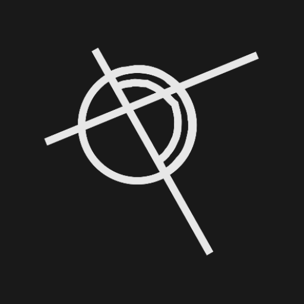
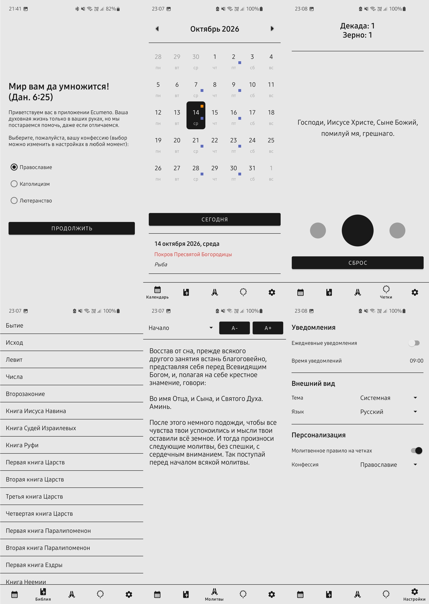
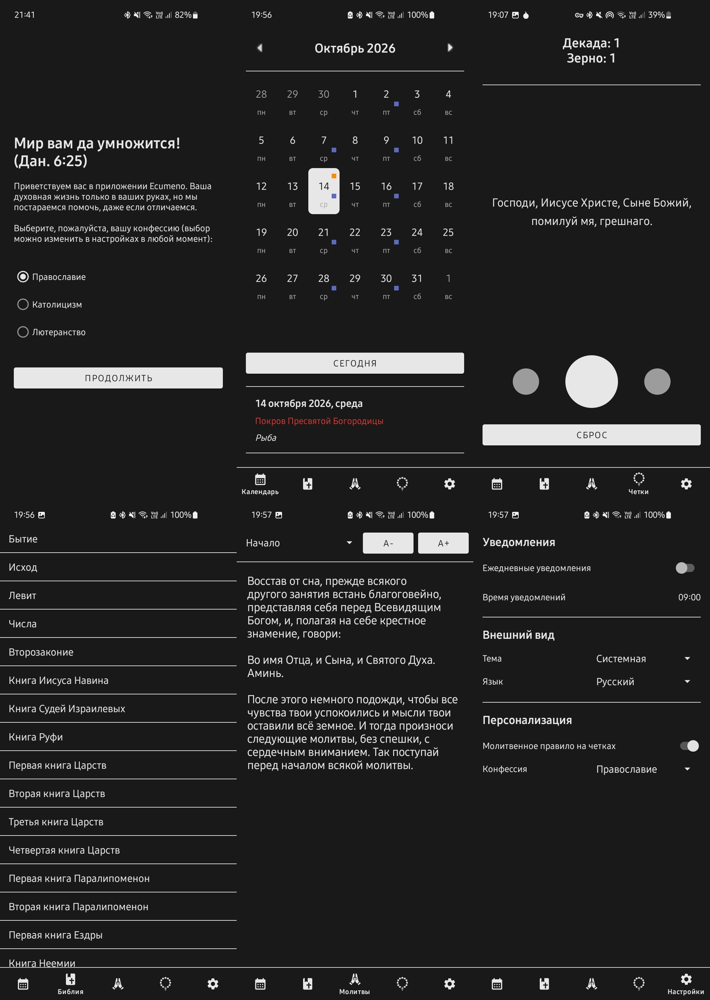

<h1 align="center">Ecumeno</h1>

  

  <b>Русский</b> &nbsp;|&nbsp; <a href="README-en.md">English</a>

  <i>«Отче Святый! соблюди их во имя Твое, тех, которых Ты Мне дал, чтобы они были едино, как и Мы... Да будут все едино, как Ты, Отче, во Мне, и Я в Тебе, так и они да будут в Нас едино» — Евангелие от Иоанна 17:11, 21</i>

  
  
  

<h2>О проекте</h2>

  Данное приложение разработано в рамках выпускной квалификационной работы и призвано поддерживать личную духовную жизнь пользователя с учетом особенностей конфессии.
  Ориентировано на христиан и поддерживает три конфессии: православие, католицизм, лютеранство.

<h3>Основной функционал</h3>
<ul>
  <li><b>Календарь</b></li>
  <li><b>Библия/молитвослов</b></li>
  <li><b>Четки</b></li>
</ul>

<h3>Особенности</h3>
<ul>
  <li><b>Выбор конфессии</b>: Список книг Библии, праздники и посты, вариант четок и молитвослова - зависят от конфессии </li>
  <li><b>Локализация:</b> Приложение имеет полную поддержку как русского, так и английского языка </li>
  <li><b>Темы:</b> Приложение имеет полную поддержку темной и светлой темы (можно задать системную или конкретную) </li>
  <li><b>Адаптивность:</b> Экраны адаптированы под разные ориентации экрана </li>
  <li><b>Уведомления:</b> Имеется поддержка уведомлений в заданное время, с данными о текущем дне (праздники, степень поста), включается в настройках</li>
  <li><b>Молитвенное правило:</b> У каждой конфессии есть четки с уникальным молитвенным правилом и структурой (отключается в настройках)</li>
  <li><b>Интерактивность:</b> Четки имеют анимированную визуализацию, управляются свайпом или клавишами кромкости и вызывают вибрацию </li>
  <li><b>Размер шрифта:</b> В модуле чтения настраивается размер шрифта </li>
  <li><b>Закладка:</b> При чтении Библии фиксируется последняя открытая книга и глава для восстановления при следующем открытии приложения </li>
</ul>

<h3>Технологии и архитектура</h3>
<ul>
  <li><b>Язык:</b> Kotlin</li>
  <li><b>UI:</b> XML Views + View Binding</li>
  <li><b>Архитектура:</b> MVVM с элементами Clean Architecture</li>
  <li><b>Структура:</b> Package-by-feature</li>
  <li><b>Внедрение зависимостей:</b> Ручное</li>
  <li><b>Хранение настроек:</b> DataStore</li>
  <li><b>Управление базой данных:</b> SQLiteOpenHelper</li>
</ul>

<h3>Скриншоты</h3>

  
  &nbsp;&nbsp;
  

<h2>Сборка</h2>
<h3>Требования для сборки</h3>
<ul>
  <li>JDK 17 или новее</li>
  <li>Android SDK</li>
</ul>

<h3>Инструкция по сборке</h3>
<ol>
  <li>Клонируйте репозиторий:</li>
</ol>

<pre>
  <code>git clone https://github.com/tyr0v-k/Ecumeno_new.git</code>
</pre>

<ol start="2">
  <li>Запустите скрипт сборки из корня репозитория:</li>
</ol>

<pre>
  <code>./gradlew assembleRelease</code>
</pre>

<ol start="3">
  <li>APK будет находиться в директории:</li>
</ol>

<pre>
  <code>app/build/outputs/apk/release/</code>
</pre>

<h2>Скачать</h2>

  

<h2>Поддержать разработчика</h2>

<i>«Молитесь друг за друга, чтобы исцелиться: много может усиленная молитва праведного» — Послание Иакова 5:16</i>

  
  &nbsp;&nbsp;
  
  &nbsp;&nbsp;
  

